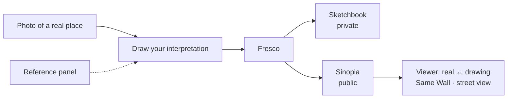

<div align="center">

# Sinopia

**Draw on the real world. Leave it where you found it.**

*Sinopia* (the reddish underdrawing a fresco painter sketched on the wall before painting)


</div>

> **Draft README.** Sinopia is being built for the Global Innovation Build Challenge V2 (Sept–Oct 2026). Features marked *planned* aren't finished yet, and this document will change as the project does.

---

## Overview

You photograph a real place and draw your own interpretation on top of it: a creature on the rooftops, a fire hydrant that isn't there, a street as you remember it. When you're unsure how something looks, a reference panel beside the canvas finds openly licensed photos of anything you're drawing.

A finished piece is a **fresco**. Keep it private in your **Sketchbook**, or publish it to your **Sinopia** — your own globe, holding only your work — pinned where you took the photo. Other artists' Sinopias orbit yours as worlds of their own; travel to one, open a fresco, slide between the real photo and the drawing, and see every other fresco made at the same spot: **same wall, different eyes**.

## Features

| Feature | Status |
|---|---|
| Capture a photo with its GPS spot (from the photo or your phone), draggable pin | Done |
| Draw over the photo: brush, eraser, colors, layers, undo/redo | Done |
| Reference panel: search anything you're drawing, with license and source on every image | Done |
| Sketchbook: your private album of frescoes | Done |
| Publish to your Sinopia, pinned at the exact spot or just the neighborhood | Done |
| Your own Sinopia: a globe of your frescoes alone, with clustered pins from world view to street level | Done |
| Other artists' Sinopias orbiting yours as their own globes, with a warp into each | Done |
| Draw in the space around your Sinopia (lasts the visit, clears on reload) | Done |
| Profile with a drawn avatar you build from parts | Done |
| Fresco viewer with a Reality ↔ Drawing slider | Done |
| Same Wall: other frescoes made within 50 m | Done |
| Report a fresco | Done |
| Street-level view of the real spot beside the fresco | Done |
| In-browser safety check before publishing | Done |
| Weather at capture ("light rain, 24°C") | Done |
| About page: licences, privacy and credits | Done |
| Terms & safety: age requirement, acceptable use, takedown contact | Done |
| Reference images used while drawing are credited on the published fresco | Done |
| Photo eyedropper: pick a colour straight from the photo | Done |
| "Looks like..." doodle-guess chips in the reference panel, from an on-device model | Done |
| Achievements: private milestones about your own work, not a ranking | Done |
| Sketch Missions: location-aware creative prompts, with a public submission gallery | Done |
| Collaborative Fresco: one shared place, many independently credited artist layers | Done |
| Seeded demo frescoes on the map | Script ready, artwork pending |

## How it works



1. **Capture.** Take or upload a photo; Sinopia reads where and when it was taken.
2. **Draw.** Sketch over the photo on your phone or laptop. The photo itself is never changed.
3. **Reference.** Type what you're drawing ("fire hydrant", "shiba inu") and keep the results beside the canvas.
4. **Keep or share.** Save to your Sketchbook, or publish to your Sinopia at the exact spot or neighborhood level.
5. **Explore.** Open any fresco, compare it with the real place, and see how others drew the same wall.

## Privacy and licensing

- **You choose what's public.** Frescoes are private by default; publishing is per fresco and can be undone any time.
- **Your exact location stays yours.** The precise spot is stored where only you can read it; the public pin is either the exact spot (your choice, with a warning) or snapped to the neighborhood. Photo metadata (EXIF, including GPS) is stripped before upload.
- **References come from openly licensed sources** via Openverse. Each shows the license, creator and source as reported upstream; check it at the source before reuse. Sinopia doesn't store reference images.
- **Your frescoes are your work.** Sinopia's code is open source; the artwork belongs to the artists.

## Tech stack ($0)

| Layer | Technology |
|---|---|
| Web app | TypeScript, Vite, React (PWA) |
| Drawing | Konva, Perfect Freehand |
| Database, auth, storage | Supabase (Postgres + PostGIS, Row Level Security) |
| Hosting | Vercel |
| Globe and maps | MapLibre GL JS, OpenFreeMap tiles, OpenStreetMap data |
| Geocoding | Nominatim (reverse), Photon (search) |
| References | Openverse API |
| Street-level imagery | Mapillary (MapillaryJS viewer), Panoramax fallback |
| Safety check | nsfwjs (TensorFlow.js), lazy-loaded at publish |
| Doodle-guess chips | DoodleNet (TensorFlow.js), lazy-loaded on request |
| Weather | Open-Meteo historical API |
| Tests | Vitest, Playwright, PGlite (schema tests) |

## Getting started

**Hosting:** Vercel (existing account), importing `Muj-csv/Sinopia` with root directory `web/`. Account setup and every key/value the team needs to send back: [docs/SETUP.md](docs/SETUP.md).

**Requirements**
- Node.js 22.22.2+, 24.15.0+, or 26+ (see `web/package.json`'s `engines` field)
- A free Supabase project (Vercel account already exists)
- (optional) A free Mapillary client token and Openverse API client

**Run the app**
```bash
git clone https://github.com/Muj-csv/Sinopia.git
cd Sinopia/web
cp .env.example .env.local   # fill in VITE_SUPABASE_URL, VITE_SUPABASE_ANON_KEY, VITE_MAPILLARY_TOKEN
npm install
npm run dev
```

**Set up the database**
```bash
# In the Supabase SQL editor (or with the Supabase CLI), run:
supabase/migrations/0001_init.sql      # from docs/schema.sql
# Optional local check of the schema and privacy rules:
npm i @electric-sql/pglite @electric-sql/pglite-postgis && node docs/schema.test.mjs
```

**Environment on Vercel:** `VITE_SUPABASE_URL`, `VITE_SUPABASE_ANON_KEY`, `VITE_MAPILLARY_TOKEN`, `OPENVERSE_CLIENT_ID`, `OPENVERSE_CLIENT_SECRET` (the last two server-side only).

## Project structure

```
web/                The Sinopia web app (capture, draw, references, frescoes, sketchbook, globe, viewer, safety)
web/api/            Vercel function: references proxy (Openverse)
supabase/           Migrations (tables, Row Level Security, storage policies)
scripts/            Seed script for the demo frescoes on the map (see scripts/README.md)
docs/               Concept, PRD, architecture, plan, decisions, design, build phases
```

## Documentation

- [Concept (one page)](docs/CONCEPT.md)
- [Product requirements](docs/PRD.md)
- [Architecture](docs/ARCHITECTURE.md) · [Database schema](docs/schema.sql)
- [Implementation plan](docs/IMPLEMENTATION_PLAN.md)
- [Decision log](docs/DECISIONS.md) · [Validation](docs/VALIDATION.md)
- [Design brief](docs/design/DESIGN_BRIEF.md) · [Screens](docs/design/SCREENS.md) · [UX map](docs/design/UX_MAP.md) · [Trend sweep](docs/design/TREND_SWEEP.md)
- [Setup checklist (accounts, keys)](docs/SETUP.md)

## Known limitations

- **Free tiers:** storage and bandwidth are limited, so images are compressed; a free Supabase project pauses after 7 days without use.
- **Street-level imagery** from open sources doesn't cover everywhere; where there's none, the viewer shows the map.
- **Reference licenses** are as reported by the source.
- **Moderation** is basic during the hackathon: one report hides a fresco until the team reviews it.

## Roadmap

- [ ] MVP for GIBC V2 (see [implementation plan](docs/IMPLEMENTATION_PLAN.md))
- [ ] "Draw this wall too": respond to someone's fresco at the same place
- [ ] Place timelines: the same wall across years
- [ ] Collections and map stories

## Team

| Name | Contact |
|---|---|
| Ian Patrick A. Flores | [muj.flores@gmail.com](mailto:muj.flores@gmail.com) · [GitHub](https://github.com/Muj-csv) |
| Jace Matthew M. Catriz | [ecaj.2007@gmail.com](mailto:ecaj.2007@gmail.com) · [GitHub](https://github.com/anonymouslugaw) |
| Fiona S. Guiao | [fsguiao@gmail.com](mailto:fsguiao@gmail.com) · [GitHub](https://github.com/pyonaa) |
| Mary Princess Angel L. Dizon | [dizon.maryprincessangel@gmail.com](mailto:dizon.maryprincessangel@gmail.com) · [GitHub](https://github.com/mpadizon) |
| Joey T. Cuison | [joeycuison333@gmail.com](mailto:joeycuison333@gmail.com) · [GitHub](https://github.com/joeycuison333-stack) |
| Eiko G. Yaiki | [emii.milk06@gmail.com](mailto:emii.milk06@gmail.com) · [GitHub](https://github.com/gomezeiko) |
| Mark Jemiel P. Guevarra | [jemielguevarra10@gmail.com](mailto:jemielguevarra10@gmail.com) · [GitHub](https://github.com/NeatKnight18586) |

## License

MIT for code. Frescoes belong to their artists.

## Acknowledgments

Built for the **Global Innovation Build Challenge V2**. Map data © OpenStreetMap contributors; tiles by OpenFreeMap / OpenMapTiles. Reference images courtesy of their creators via Openverse; street-level imagery from Mapillary and Panoramax contributors.
