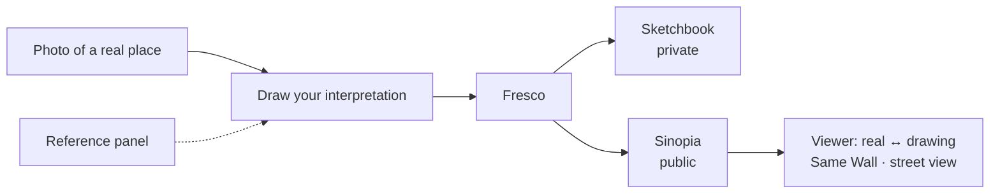
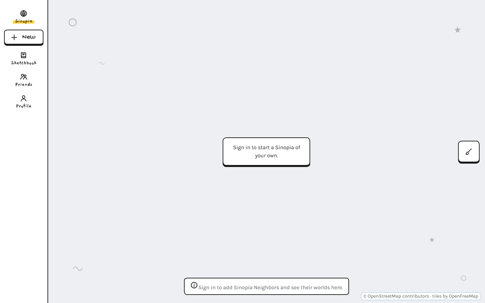
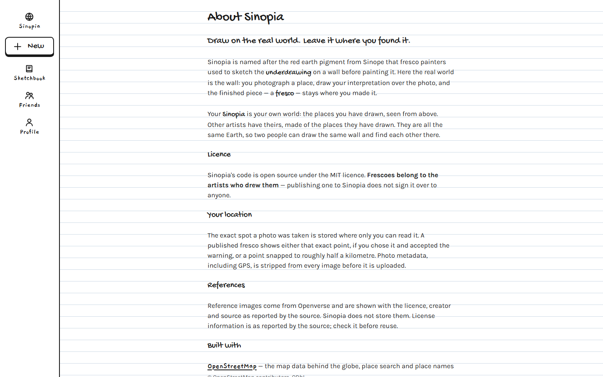
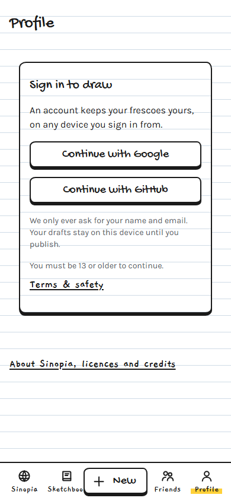

<div align="center">

# Sinopia

**Draw on the real world. Leave it where you found it.**

_Sinopia_ (the reddish underdrawing a fresco painter sketched on the wall before painting)


**[Live app: sinopia.vercel.app](https://sinopia.vercel.app)**

</div>

> **Draft README.** Sinopia is being built for the Global Innovation Build Challenge V2 (Sept–Oct 2026). Features marked _planned_ aren't finished yet, and this document will change as the project does.

---

## Project description

### What we built

Sinopia is a mobile-first web app for drawing on the real world. You photograph a place, draw your own interpretation on top of the photo — with a reference panel built into the canvas for anything you're unsure how to draw — and keep the result in a private **Sketchbook** or publish it to **your Sinopia**, a globe holding only your own work, pinned where you took the photo. Other artists' Sinopias orbit yours as worlds of their own; open one of their frescoes and you can slide between the real photo and the drawing, see the street-level view of that spot, and browse every other fresco anyone has made at the same place.

### The problem it solves

Map-art apps pin drawings to coordinates. Photo apps store photos. Reference sites find you images to work from. None of them treat those as one thing. Sinopia's unit is **photo + drawing + place + time**: references are built into the drawing step instead of a separate tool, and discovery is geographic — **Same Wall**, who else drew this exact spot — instead of social. There are no likes, follower counts or feeds anywhere in the app.

### Who it's for

- **Primary:** art students and hobby artists who sketch on location or like drawing over photos, and want both reference material and a place to keep that work tied to where they made it.
- **Secondary:** anyone exploring a place through how other people drew it — travellers, locals, classmates comparing notes on the same street corner.

### How it works



1. **Capture.** Take or upload a photo; Sinopia reads where and when it was taken.
2. **Draw.** Sketch over the photo on your phone or laptop. The photo itself is never changed.
3. **Reference.** Type what you're drawing ("fire hydrant", "shiba inu") and keep the results beside the canvas, or tap _What am I drawing?_ and let an on-device model guess from your strokes.
4. **Keep or share.** Save to your Sketchbook, or publish to your Sinopia at the exact spot or neighborhood level.
5. **Explore.** Open any fresco, compare it with the real place, and see how others drew the same wall.

## Setup instructions

**Hosting:** Vercel (existing account), importing `Muj-csv/Sinopia` with root directory `web/`. Account setup and every key/value the team needs to send back: [docs/SETUP.md](docs/SETUP.md).

**Requirements / prerequisites**

- Node.js 22.22.2+, 24.15.0+, or 26+ (see `web/package.json`'s `engines` field)
- A free Supabase project (Vercel account already exists)
- (optional) A free Mapillary client token and Openverse API client

**Install dependencies and run locally**

```bash
git clone https://github.com/Muj-csv/Sinopia.git
cd Sinopia/web
cp .env.example .env.local   # fill in VITE_SUPABASE_URL, VITE_SUPABASE_ANON_KEY, VITE_MAPILLARY_TOKEN
npm install
npm run dev
```

**Configure and set up the database**

```bash
# In the Supabase SQL editor (or with the Supabase CLI), run:
supabase/migrations/0001_init.sql      # from docs/schema.sql
# Optional local check of the schema and privacy rules:
npm i @electric-sql/pglite @electric-sql/pglite-postgis && node docs/schema.test.mjs
```

**Environment on Vercel:** `VITE_SUPABASE_URL`, `VITE_SUPABASE_ANON_KEY`, `VITE_MAPILLARY_TOKEN`, `OPENVERSE_CLIENT_ID`, `OPENVERSE_CLIENT_SECRET` (the last two server-side only).

## Technologies used

Every piece of the stack is free and needs no credit card on file — picked deliberately for a $0 budget (see [docs/CONCEPT.md §6](docs/CONCEPT.md)).

| Layer                   | Technology                                            |
| ----------------------- | ----------------------------------------------------- |
| Web app (framework)     | TypeScript, Vite, React (PWA)                         |
| Drawing (libraries)     | Konva, Perfect Freehand                               |
| Database, auth, storage | Supabase (Postgres + PostGIS, Row Level Security)     |
| Hosting                 | Vercel                                                |
| Globe and maps (APIs)   | MapLibre GL JS, OpenFreeMap tiles, OpenStreetMap data |
| Geocoding (APIs)        | Nominatim (reverse), Photon (search)                  |
| References (API)        | Openverse API                                         |
| Street-level imagery    | Mapillary (MapillaryJS viewer), Panoramax fallback    |
| Safety check (ML)       | nsfwjs (TensorFlow.js), lazy-loaded at publish        |
| Doodle-guess chips (ML) | DoodleNet (TensorFlow.js), lazy-loaded on request     |
| Weather (API)           | Open-Meteo historical API                             |
| Tests                   | Vitest, Playwright, PGlite (schema tests)             |

## Features

| Feature                                                                                               | Status                        |
| ----------------------------------------------------------------------------------------------------- | ----------------------------- |
| Capture a photo with its GPS spot (from the photo or your phone), draggable pin                       | Done                          |
| Draw over the photo: brush, eraser, colors, layers, undo/redo                                         | Done                          |
| Reference panel: search anything you're drawing, with license and source on every image               | Done                          |
| Sketchbook: your private album of frescoes                                                            | Done                          |
| Publish to your Sinopia, pinned at the exact spot or just the neighborhood                            | Done                          |
| Your own Sinopia: a globe of your frescoes alone, with clustered pins from world view to street level | Done                          |
| Other artists' Sinopias orbiting yours as their own globes, with a warp into each                     | Done                          |
| Draw in the space around your Sinopia (lasts the visit, clears on reload)                             | Done                          |
| Profile with a drawn avatar you build from parts                                                      | Done                          |
| Fresco viewer with a Reality ↔ Drawing slider                                                         | Done                          |
| Same Wall: other frescoes made within 50 m                                                            | Done                          |
| Report a fresco                                                                                       | Done                          |
| Street-level view of the real spot beside the fresco                                                  | Done                          |
| In-browser safety check before publishing                                                             | Done                          |
| Weather at capture ("light rain, 24°C")                                                               | Done                          |
| About page: licences, privacy and credits                                                             | Done                          |
| Terms & safety: age requirement, acceptable use, takedown contact                                     | Done                          |
| Reference images used while drawing are credited on the published fresco                              | Done                          |
| Photo eyedropper: pick a colour straight from the photo                                               | Done                          |
| "Looks like..." doodle-guess chips in the reference panel, from an on-device model                    | Done                          |
| Achievements: private milestones about your own work, not a ranking                                   | Done                          |
| Seeded demo frescoes on the map                                                                       | Script ready, artwork pending |

## Demo / live deployment

**Live app:** **https://sinopia.vercel.app** — sign in with Google or GitHub and draw on a photo. `main` auto-deploys there on every merge, and every pull request gets its own Vercel preview deployment (visible in that PR's checks).

No demo video yet — the link above is the fastest way to see it working.

## Screenshots

| Sinopia system (desktop)                                                                                             | About page (desktop)                                                                    | Sign in (mobile)                                                                                          |
| -------------------------------------------------------------------------------------------------------------------- | --------------------------------------------------------------------------------------- | --------------------------------------------------------------------------------------------------------- |
|  |  |  |

## Privacy and licensing

- **You choose what's public.** Frescoes are private by default; publishing is per fresco and can be undone any time.
- **Your exact location stays yours.** The precise spot is stored where only you can read it; the public pin is either the exact spot (your choice, with a warning) or snapped to the neighborhood. Photo metadata (EXIF, including GPS) is stripped before upload.
- **References come from openly licensed sources** via Openverse. Each shows the license, creator and source as reported upstream; check it at the source before reuse. Sinopia doesn't store reference images, but does record the title/creator/licence of any reference pinned while drawing, so a fresco's attribution travels with it.
- **Your frescoes are your work.** Sinopia's code is open source; the artwork belongs to the artists.

## Challenges & solutions

**Publishing silently failed for every artist.** After the globe storage bucket shipped, publishing a fresco failed 100% of the time. The storage policy only granted `INSERT`, but the client publishes with `upsert: true`, which Postgres runs as `INSERT ... ON CONFLICT DO UPDATE` — a statement that needs `SELECT` and `UPDATE` privileges too, even when nothing actually conflicts. We added the missing policies and wrote `docs/schema.test.mjs`: a local Postgres instance (PGlite + PostGIS) that exercises the _exact_ statements the client issues, not just the obvious ones, so this class of bug now fails a test instead of reaching production.

**A safety-check library nearly broke the production build.** Adding `nsfwjs` (the in-browser check before publishing) blew past the PWA's precache size limit and failed the build, because its default import statically pulls in all three of its bundled models — tens of MB combined — even though the app only needs one. We imported just the specific model it actually uses and lazy-loaded it with `import()` right before a publish, so it costs nothing until someone tries to publish. The same pattern was reused later for the doodle-guess classifier.

**A mid-hackathon pivot.** The team's original direction was pose/gesture matching — a different idea entirely. Days into the build it became clear the idea didn't hold up, so the team dropped it and rebuilt around "draw on the real world" instead, rewriting the concept, PRD and architecture docs in one pass before writing more feature code.

**Keeping a free-tier database alive through judging.** Supabase's free tier pauses a project after 7 days of inactivity — a real risk of the whole demo going dark mid-judging. We settled on a documented rotation: a teammate opens the app every few days to keep the project warm.

**A formatting check that slipped past review.** CI's Prettier check caught real issues that a Windows checkout's line-ending differences had been masking locally. A PR got merged before its formatting fix landed, leaving `main`'s CI red. Rather than pushing a fix straight to `main`, we opened a dedicated fix PR, verified every check locally first, and merged that — keeping "never push directly to main" intact even for a one-line fix.

## Learning & growth

- **Privacy enforced by the database, not the client.** Exact GPS lives in an owner-only table; a `security definer` trigger derives the public point (exact, or snapped to ~550 m) server-side, so the client never computes or even sees the number it isn't supposed to show. Row Level Security became the main defensive layer instead of a custom API server.
- **Storage policies follow the statement, not the intent.** The publish bug above was the team's clearest lesson that Postgres privileges are checked against what SQL actually runs, not what the developer meant to do.
- **Running machine learning with no server at all.** Two separate TensorFlow.js models — a safety classifier and a doodle-recognition CNN — run entirely in the browser, each lazy-loaded into its own bundle chunk. Getting that right meant learning how aggressively a naive import can bloat a PWA's precache, and how to avoid it.
- **PostGIS for the first time.** Snapping exact coordinates to a coarse grid for "neighborhood" privacy, and finding nearby frescoes with `ST_DWithin` for Same Wall, was the team's first hands-on use of PostGIS geography types.
- **Building to a real $0 ceiling.** Every tool had to be free with no credit card on file, which shaped real architecture decisions, not just the invoice: OAuth-only sign-in because Supabase's free email sender is rate-limited, OpenFreeMap and Mapillary/Panoramax instead of anything from Google that needs billing enabled.
- **Validating the idea before committing more time to it.** The hardest lesson was organizational, not technical: recognizing a direction wasn't working and rewriting the concept docs before writing more feature code, rather than after.

## Future improvements

- Finish seeding the globe with real demo frescoes (the script is ready; the artwork isn't)
- "Draw this wall too": respond to someone else's fresco at the same place
- Place timelines: the same wall, the same spot, across years
- Collections and map stories
- Broader moderation tooling beyond "one report hides it until the team reviews it"

## Project structure

```
web/                The Sinopia web app (capture, draw, references, frescoes, sketchbook, globe, viewer, safety)
web/api/            Vercel function: references proxy (Openverse)
supabase/           Migrations (tables, Row Level Security, storage policies)
scripts/            Seed script for the demo frescoes on the map (see scripts/README.md)
docs/               Concept, PRD, architecture, plan, decisions, design, build phases
```

## Documentation

- [Concept (one page)](docs/CONCEPT.md)
- [Product requirements](docs/PRD.md)
- [Architecture](docs/ARCHITECTURE.md) · [Database schema](docs/schema.sql)
- [Implementation plan](docs/IMPLEMENTATION_PLAN.md)
- [Decision log](docs/DECISIONS.md) · [Validation](docs/VALIDATION.md)
- [Design brief](docs/design/DESIGN_BRIEF.md) · [Screens](docs/design/SCREENS.md) · [UX map](docs/design/UX_MAP.md) · [Trend sweep](docs/design/TREND_SWEEP.md)
- [Setup checklist (accounts, keys)](docs/SETUP.md)

## Known limitations

- **Free tiers:** storage and bandwidth are limited, so images are compressed; a free Supabase project pauses after 7 days without use.
- **Street-level imagery** from open sources doesn't cover everywhere; where there's none, the viewer shows the map.
- **Reference licenses** are as reported by the source.
- **Moderation** is basic during the hackathon: one report hides a fresco until the team reviews it.

## Team

| Name                         | Contact                                                                                                               |
| ---------------------------- | --------------------------------------------------------------------------------------------------------------------- |
| Ian Patrick A. Flores        | [muj.flores@gmail.com](mailto:muj.flores@gmail.com) · [GitHub](https://github.com/Muj-csv)                            |
| Jace Matthew M. Catriz       | [ecaj.2007@gmail.com](mailto:ecaj.2007@gmail.com) · [GitHub](https://github.com/anonymouslugaw)                       |
| Fiona S. Guiao               | [fsguiao@gmail.com](mailto:fsguiao@gmail.com) · [GitHub](https://github.com/pyonaa)                                   |
| Mary Princess Angel L. Dizon | [dizon.maryprincessangel@gmail.com](mailto:dizon.maryprincessangel@gmail.com) · [GitHub](https://github.com/mpadizon) |
| Joey T. Cuison               | [joeycuison333@gmail.com](mailto:joeycuison333@gmail.com) · [GitHub](https://github.com/joeycuison333-stack)          |
| Eiko G. Yaiki                | [emii.milk06@gmail.com](mailto:emii.milk06@gmail.com) · [GitHub](https://github.com/gomezeiko)                        |
| Mark Jemiel P. Guevarra      | [jemielguevarra10@gmail.com](mailto:jemielguevarra10@gmail.com) · [GitHub](https://github.com/NeatKnight18586)        |

## License

MIT for code. Frescoes belong to their artists.

## AI assistance disclosure

AI tools (Claude, via Claude Code) were used throughout this project's development as development and learning aids: brainstorming and researching approaches (including finding a usable on-device doodle-classification model and checking its license and hosting before depending on it), generating and refactoring code, debugging production issues, explaining unfamiliar APIs (PostGIS, Row Level Security, TensorFlow.js), and handling process tasks like CI fixes and repository cleanup.

Every AI-assisted change was reviewed, tested and integrated by the team before merging — pull requests are squash-merged only after review, the schema has its own automated privacy tests (`docs/schema.test.mjs`), and the team made every scope and architecture call explicitly (what to build, what to defer, how privacy should work, when to override an earlier decision), with AI assisting the implementation rather than deciding it. Several commits in this repository's history carry a `Co-Authored-By: Claude` trailer for exactly this reason: it's an accurate record of who wrote what, not a disclaimer buried at the bottom.

## Acknowledgments

Built for the **Global Innovation Build Challenge V2**. Map data © OpenStreetMap contributors; tiles by OpenFreeMap / OpenMapTiles. Reference images courtesy of their creators via Openverse; street-level imagery from Mapillary and Panoramax contributors.
