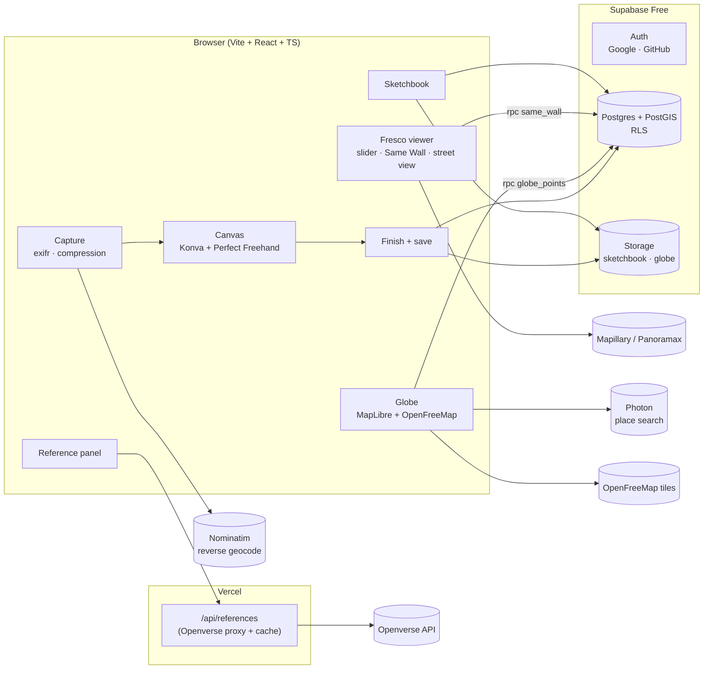
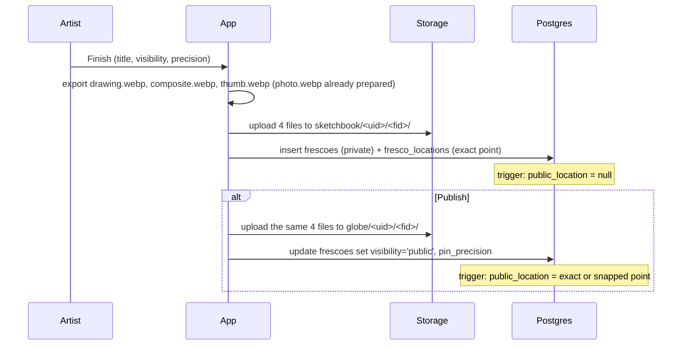
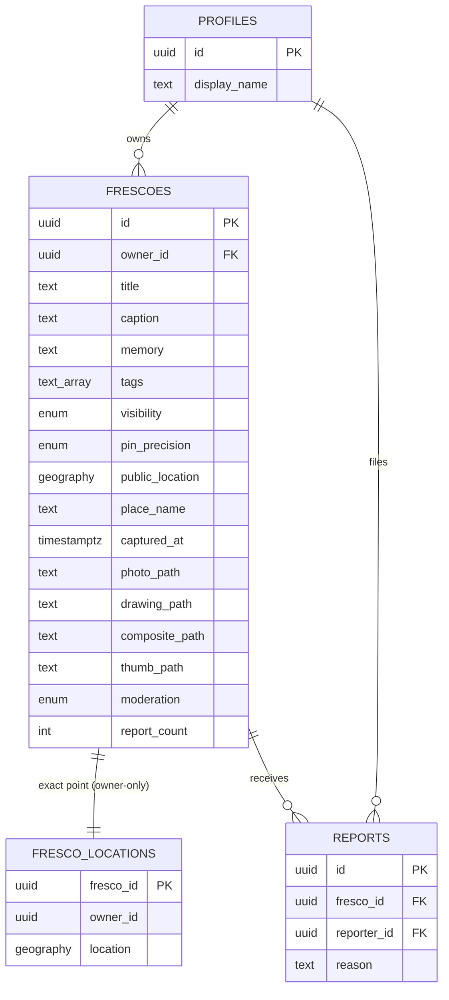

# Sinopia: Architecture

*v1.0 · 2026-09-27 · implements `PRD.md` v1.0*

## 1. Overview

Sinopia is a mobile-first single-page web app on Vercel that talks directly to Supabase (Postgres + PostGIS, Auth, Storage) with the public anon key. Row Level Security and storage policies do the access control, so there's no custom backend. One small Vercel function proxies the Openverse reference search, to keep the Openverse client secret off the browser and to cache results. Everything else (maps, street-level imagery, geocoding) is called from the browser against free, open services.

## 2. Components

| Component | Responsibility | Justifies |
|---|---|---|
| `src/auth/` | Supabase OAuth (Google, GitHub), session, sign-in gate on create/publish/report | FR-001 |
| `src/capture/` | Camera/upload, EXIF read (exifr), location fallback, draggable pin (MapLibre mini-map), reverse geocode (Nominatim), resize + WebP + thumbnail (browser-image-compression / canvas) | FR-002, FR-003, NFR-001 |
| `src/draw/` | Konva stage: photo layer (locked) + 3 drawing layers; Perfect Freehand strokes; eraser; colors; undo/redo stack; pinch/pan; draft autosave (IndexedDB via idb-keyval); export drawing layer (transparent WebP) and composite | FR-004 |
| `src/references/` | Search UI, results panel/bottom sheet, angle chips, license display; calls `/api/references` | FR-005, NFR-004 |
| `api/references.ts` | Vercel function: validate query, call Openverse with client credentials, trim fields, `Cache-Control: s-maxage=86400` | FR-005, NFR-005 |
| `src/frescoes/` | Finish form, save (upload + insert), publish/unpublish (copy to/remove from `globe`), delete | FR-006–FR-008, FR-012 |
| `src/globe/` | MapLibre globe, GeoJSON source with clustering from `globe_points()`, preview card, Photon search | FR-009 |
| `src/viewer/` | Fresco viewer, Reality ↔ Drawing slider, `same_wall()`, street-level panel, report dialog | FR-010, FR-011, FR-013, FR-015 |
| `src/sketchbook/` | Owner's frescoes grouped by place/month, carousel | FR-012 |
| `src/safety/` *(if time)* | nsfwjs check before publish, lazy-loaded | FR-016 |
| `docs/schema.sql` → `supabase/migrations/0001_init.sql` | Tables, triggers, RLS, RPCs, buckets, storage policies | NFR-001, NFR-005 |
| `scripts/seed.ts` | Upload the team's demo frescoes with a seed account | FR-014 |

## 3. Key flows

### Save and publish

Unpublish reverses it: `update visibility='private'` (trigger clears the public point), then delete `globe/<uid>/<fid>/*`. If a storage step fails after the database step, the app retries and surfaces "Couldn't finish publishing, try again"; a fresco with visibility `private` is always safe even if public files linger, because the globe only lists `public` rows.

### Explore

1. Globe loads → `rpc('globe_points')` (≤ 5,000 rows: id, title, thumb path, lng/lat) → MapLibre GeoJSON source with `cluster: true`.
2. Tap pin → preview card with thumbnail from `globe` bucket public URL.
3. Open → `frescoes` row (RLS returns only public or own) → composite + photo URLs → slider.
4. `rpc('same_wall', {p_fresco, p_radius_m: 50})` → strip.
5. *(if time)* Mapillary search: `GET https://graph.mapillary.com/images?fields=id,computed_geometry&bbox=<±0.0006°>&limit=5` with the client token → nearest image within 60 m → MapillaryJS viewer; else Panoramax STAC search (`https://api.panoramax.xyz/api/search?bbox=…&limit=5`) → its viewer; else map only.

## 4. Data model

Full SQL, tested locally (PGlite + PostGIS with Supabase stubs, 17 checks in `docs/schema.test.mjs`): **`docs/schema.sql`**. Summary:

Design choices:
- **Exact point in its own table.** RLS filters rows, not columns; a public fresco row must never carry the exact point.
- **`public_location` is derived by a trigger**, never written by the client (column grants forbid it): `exact` → the point; `neighborhood` → snapped to a 0.005° grid (~550 m); `private` → null.
- **Moderation fields are not updatable by users** (column grants). One report flags a fresco; flagged frescoes are hidden from everyone but the owner.
- **Read functions are `security invoker`**, so RLS applies inside them.

## 5. Security and privacy

- **Keys:** browser gets `VITE_SUPABASE_URL`, `VITE_SUPABASE_ANON_KEY`, `VITE_MAPILLARY_TOKEN` (a client token, designed for browsers). Server-only (Vercel env): `OPENVERSE_CLIENT_ID`, `OPENVERSE_CLIENT_SECRET`. The Supabase service-role key is used only by `scripts/seed.ts` on a teammate's machine, never committed.
- **RLS on every table**, storage policies scoped to `<uid>/` folders; `globe` bucket is public-read, `sketchbook` is private.
- **EXIF stripped** by re-encoding every image through canvas → WebP before upload.
- **Neighborhood by default**; street-level view hidden for neighborhood-precision frescoes.
- **Auth:** OAuth only (Google, GitHub). Supabase's built-in email sender is heavily rate-limited on free projects, so no magic links.
- **Inputs:** length checks in the database; tags limited to 5 × 24 chars in the UI; reference query ≤ 60 chars, stripped of control characters in the function.
- **Vercel function:** only `GET /api/references?q=&page=`; rejects other methods; no user data passes through it.
- **Map key hygiene:** OpenFreeMap needs no key. The Mapillary token is scoped to read; rotate it after the hackathon if the repo is public.

## 6. Stack ($0, checked 2026-09-27)

| Layer | Choice | Cost / license | Why this one |
|---|---|---|---|
| App | Vite + React + TypeScript (PWA via vite-plugin-pwa) | MIT | Static SPA; simplest on Vercel; no SSR needed |
| Hosting | Vercel Hobby | Free, non-commercial | Git push → deploy; `api/` functions included. Fallback: Cloudflare Pages |
| Database / Auth / Storage | Supabase Free | Free: 500 MB DB, 1 GB storage, 5 GB egress, 50k MAU; pauses after 7 idle days | Postgres + PostGIS + OAuth + storage in one free project |
| Globe and maps | MapLibre GL JS v5 (globe projection, clustering) | BSD-3 | Open source; no key |
| Tiles | OpenFreeMap ("Positron" or "Liberty" style) | Free, no key, no limits | Attribution required |
| Place search | Photon (photon.komoot.io) | Free public API, fair use | Supports search-as-you-type |
| Reverse geocoding | Nominatim (OSM) | Free; ≤ 1 request/second; no autocomplete | One call per new fresco |
| EXIF | exifr | MIT | Fast, reads GPS + time |
| Image compression | browser-image-compression | MIT | WebP, size targets, web worker |
| Drawing | Konva + react-konva, Perfect Freehand | MIT | Layers + natural strokes; tldraw avoided (needs a production license key) |
| Drafts | idb-keyval (IndexedDB) | Apache-2.0 | Tiny |
| References | Openverse API via `/api/references` | Free; register a client for higher limits | Openly licensed images incl. Wikimedia Commons and Flickr, with license fields |
| Street-level *(if time)* | Mapillary API v4 + MapillaryJS; Panoramax API + viewer as fallback | Free token; imagery CC BY-SA / open | Google Street View avoided (billing card required) |
| Safety *(if time)* | nsfwjs (TensorFlow.js) | MIT | Runs in the browser, lazy-loaded at publish |
| Weather *(if time)* | Open-Meteo historical API | Free, no key, non-commercial | One call per fresco |
| Tests | Vitest, Playwright (smoke), `docs/schema.test.mjs` (PGlite) | MIT/Apache | — |

## 7. Performance and free-tier budget

| Budget | Target | How |
|---|---|---|
| Composite / photo / drawing | ≤ 350 KB each at 1600 px WebP | browser-image-compression, quality 0.8 |
| Thumbnail | ≤ 40 KB at 400 px | Globe cards and Sketchbook use only thumbnails |
| Storage per fresco | ~1 MB (4 images) in `sketchbook` + ~1 MB in `globe` if public | ~500 public frescoes fit in 1 GB with headroom; plenty for the hackathon |
| Egress | 5 GB/month | Thumbnails everywhere except the open viewer; `Cache-Control` on uploads (`cacheControl: '31536000'`, files are immutable per fresco) |
| Globe payload | ≤ 5,000 points, ~300 KB JSON | Single RPC; clustering in MapLibre |
| JS bundle | ≤ 350 KB gzipped initial | Lazy-load drawing, viewer, safety model and MapillaryJS by route |

**10× growth:** the first things to break are storage (1 GB) and egress (5 GB). Past ~2,000 public frescoes, move images to Cloudflare R2's free tier or pay for Supabase Pro; past ~5,000 globe points, switch `globe_points` to a bounding-box query.

## 8. Failure behaviour

| Dependency down | What the user sees |
|---|---|
| EXIF has no GPS | "No location in this photo. Use my current location / Place it on the map" |
| Geolocation denied | Map picker only |
| Nominatim fails or is slow (> 3 s) | Place name left blank and editable; saving continues |
| Openverse / function fails | "References are unavailable right now" + retry; drawing unaffected |
| Upload fails mid-save | Draft stays in IndexedDB; "Saved as draft on this device; retry upload" |
| Supabase paused / unreachable | Globe shows "The gallery is waking up" with retry; creating works offline as a draft |
| Mapillary / Panoramax have nothing nearby | Map of the spot + "No street-level imagery here yet" |
| Tiles fail | Globe falls back to a plain sphere with pins (no basemap) |

## 9. Architecture decisions

**ADR-001: Supabase directly from the browser, secured by RLS, instead of a custom API server.** *Proposed.* Every read and write is a single-table operation or a small RPC; RLS and storage policies express all the access rules (tested in `schema.test.mjs`). Trade-off: business rules live in SQL; mistakes in policies are security bugs, so policies are tested before UI work. Revisit if moderation or feeds need server logic.

**ADR-002: Two storage buckets (private `sketchbook`, public `globe`) with copies on publish.** *Proposed.* Public images load from a CDN URL without auth calls; private images are never publicly addressable. Trade-off: publishing doubles storage for that fresco; unpublish must delete the copies.

**ADR-003: Exact location in an owner-only table; public point derived by trigger.** *Proposed.* Row-level security can't hide one column, and client-computed "fuzzing" can be bypassed. Trade-off: one extra insert per fresco.

**ADR-004: Open map stack (MapLibre + OpenFreeMap + Photon + Nominatim + Mapillary/Panoramax) instead of Google Maps.** *Proposed.* Meets the $0/no-card rule and has no key to leak. Trade-off: street-level coverage is thinner than Google's; the viewer must look complete without it.

**ADR-005: Openverse as the only reference source, through a caching proxy.** *Proposed.* One integration, consistent license fields, free. Trade-off: fewer polished product-style photos than Unsplash/Pexels; those can be added later behind the same function.

**ADR-006: No generative AI.** *Proposed.* The product is the artist's own interpretation; references are real, licensed photos.

## 10. Testing

- **Database:** `node docs/schema.test.mjs` (privacy, precision snapping, Same Wall, reports, storage folders); repeat the key checks against the real Supabase project in Phase 0 using two test accounts.
- **Unit (Vitest):** EXIF parsing fallbacks, image pipeline output sizes and stripped metadata, undo/redo stack, reference response mapping (license fields present), pin precision UI → payload.
- **Smoke (Playwright, desktop + mobile viewport):** sign in with a test user → upload fixture photo → draw 3 strokes → save private → publish → globe shows pin → viewer shows slider and Same Wall → unpublish → pin gone.
- **Manual on a real phone:** drawing latency, camera capture, bottom-sheet references while drawing.
