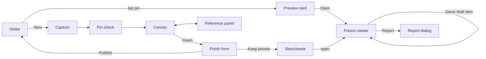

# UX_MAP — Sinopia

Updated 2026-09-27 · Screens, flows and states for PRD v1.0. Names match ARCHITECTURE §2. AERIAL decides **when** a state happens; this file names the condition and what the user sees and does.

## Flows

## Screens and their one job

| Screen | Route | One job | Primary action |
|---|---|---|---|
| Globe | `/` | Find frescoes by place | Tap a pin / search a place |
| Capture | `/new` | Get a photo and its spot | Camera / Upload |
| Pin check | `/new/pin` | Confirm where it was taken | Confirm (drag pin if needed) |
| Canvas | `/new/draw` | Draw over the photo | Draw; Reference; Finish |
| Reference panel | (in Canvas) | See how something looks | Search; pin a result |
| Finish form | `/new/finish` | Name it and choose who sees it | Keep in Sketchbook / Publish |
| Fresco viewer | `/f/:id` | See the drawing against the real place | Drag the slider |
| Sketchbook | `/sketchbook` | Find and manage your own frescoes | Open one |
| Profile / About | `/me`, `/about` | Name, sign out; licenses and credits | — |

## State matrix (conditions)

| Screen | Empty / first run | Loading | Error | Partial | Offline | No permission / signed out | Success |
|---|---|---|---|---|---|---|---|
| Globe | No public frescoes (never in production thanks to the seed): "The world is blank. Be the first to leave a fresco." | Plaster sphere + "Loading the gallery…" | Supabase paused/unreachable: "The gallery is waking up" + Retry | Tiles fail: plain sphere with pins; a thumbnail fails: placeholder | Cached shell + "You're offline. New frescoes save as drafts." | Browsing works signed out; *New* asks to sign in | Pins and clusters |
| Capture | Sheet: Camera · Upload · Resume draft (if any) | "Reading photo…" | File too big / not an image: danger notice with the limit | Photo has no GPS: "No location in this photo" → Use my location / Place on map | Works (draft only) | Camera blocked → Upload highlighted; location denied → map picker | Photo ready → Pin check |
| Pin check | — | Place name loading (≤ 3 s) | Nominatim fails: place name blank, editable | — | Pin works; place name later | — | Confirm |
| Canvas | First time: 3-step hint (draw · reference · finish), dismissible | Photo decoding | Out of memory on huge photos: already prevented by the 1600 px pipeline | Draft restored: "Continuing your sinopia from 10:42" | Works; autosave to device | — | Finish enabled once ≥ 1 stroke |
| Reference panel | Suggested words: "try: fire hydrant, cat, bicycle, tree" | 6 thumbnail skeletons | "References are unavailable right now" + Retry | Some thumbnails fail: hidden; results missing license are never shown | "References need a connection" | — | Grid + pinned reference |
| Finish form | — | Uploading: progress per image | Upload fails: "Saved as a draft on this device" + Retry | Private save done but publish failed: "Saved to your Sketchbook. Publishing didn't finish" + Try again | Save as draft only | Signed out → sign-in, then return with the drawing intact | Private → Sketchbook with toast; Public → fly to the pin, ink-in |
| Fresco viewer | — | Image placeholder in the artwork's aspect ratio | Not found / private / flagged: "This fresco isn't available." + Back to globe | Photo layer missing: slider hidden, composite only | Cached if opened before | Report needs sign-in | Artwork, slider, details |
| Same Wall strip | "Nobody else has drawn this wall yet." | 4 skeletons | Hidden silently (non-essential) | — | Hidden | — | Nearest first |
| Street-level panel *(if time)* | Neighborhood precision: hidden entirely | Spinner in the panel | "Street-level view unavailable" | — | Hidden | — | Viewer + credit |
| Sketchbook | "Your Sketchbook is empty. Tap New to make your first fresco." | Grid skeletons | Retry banner | Some thumbs fail: placeholders | Cached list if opened before | Signed out → sign-in | Grid / carousel |
| Report dialog | — | Submitting | "Couldn't send the report" + Retry | — | Disabled with reason | Sign-in required | "Thanks. It's hidden while we review it." |
| Delete / unpublish | Confirm dialog naming the fresco | Working | Retry | Unpublished but public files not all deleted: retried in background | Disabled | — | Toast |

## Copy rules
- Say what happened and what to do next, in plain words; never blame the user.
- Privacy choices are stated plainly at the moment they matter: "Everyone can see this fresco and its neighborhood" / "Everyone can see the exact spot where you took this photo."
- Use the vocabulary: *fresco*, *underdrawing* (draft), *Sketchbook*, *Same Wall*, *Sinopia* (the artist's world). Never "post", "likes", "followers", "trending". Since Update 1.2 "sinopia" names the world, never the draft — a screen that says both is a bug.
